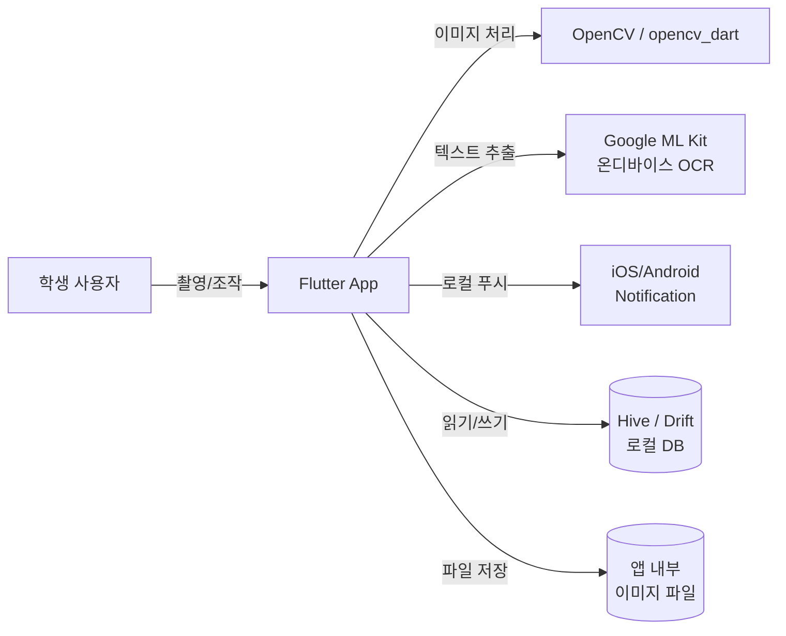
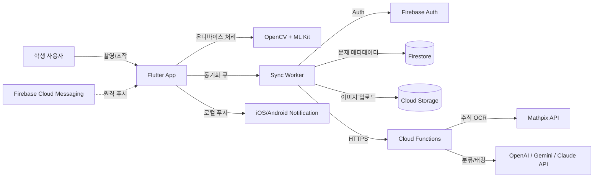
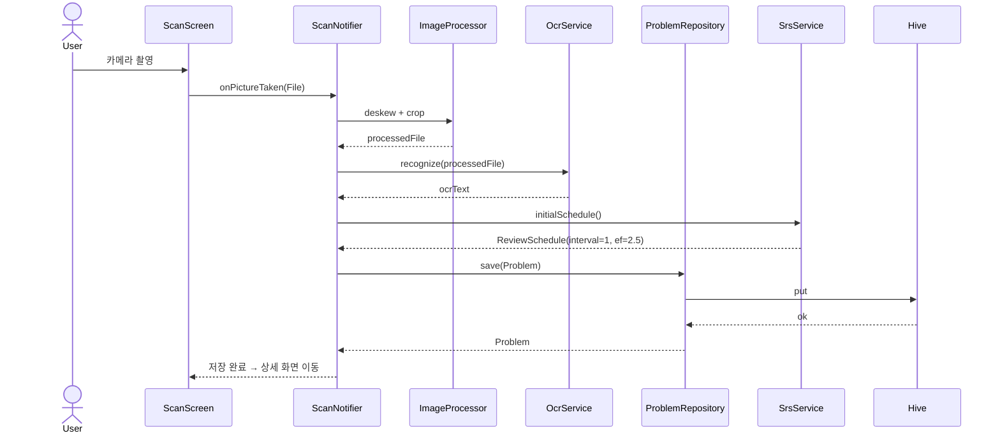
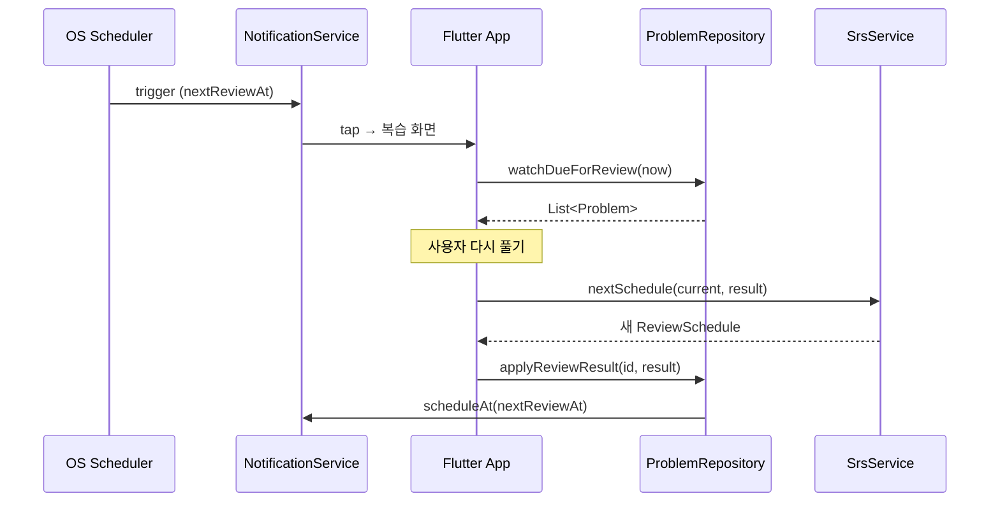
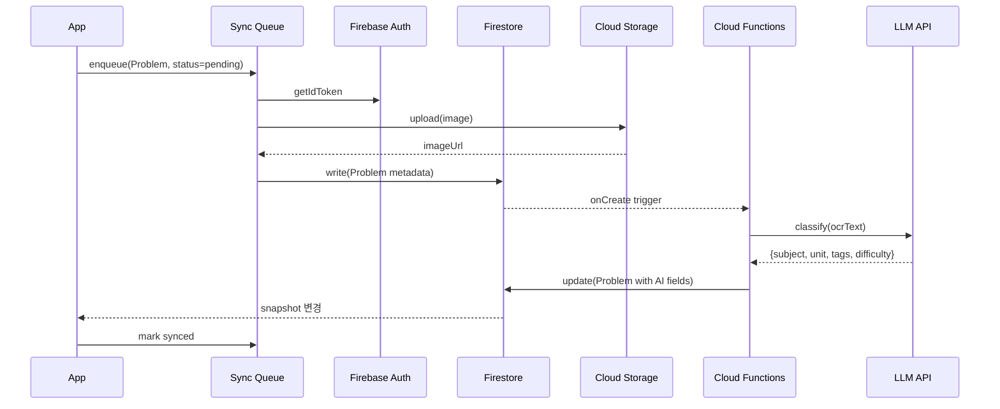
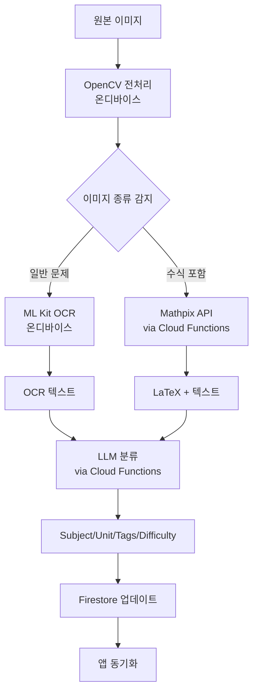

# 오답똑똑 — 기술 아키텍처

> 작성일: 2026-06-06
> 기반 문서: [IDEATION.md](IDEATION.md)
> 대상: Flutter 기반 iOS/Android 동시 출시, 개인 개발자 운영 가정

---

## 1. 아키텍처 원칙

1. **오프라인 우선 (Offline-first)** — 인터넷이 끊겨도 스캔/저장/복습이 동작. 동기화는 백그라운드.
2. **온디바이스 우선 (On-device-first)** — 학생 답안지는 민감 정보. 가능한 처리는 폰에서, 클라우드는 무거운 작업만.
3. **점진적 복잡도 (Phase-gated)** — Phase 1은 로컬만, Phase 2에서 백엔드·LLM 도입, Phase 3에서 인페인팅.
4. **느슨한 결합 (Loose coupling)** — OCR/LLM/저장소를 인터페이스로 추상화해 공급자 교체 가능.
5. **단방향 데이터 흐름** — Riverpod 기반 View → Notifier → Repository → DataSource.

---

## 2. 시스템 컨텍스트

### Phase 1 (MVP)



### Phase 2 (확장)



---

## 3. Flutter 앱 내부 아키텍처

### 3.1 레이어 구조

```
lib/
├── app/                      # 앱 진입점, 라우팅, 테마
│   ├── app.dart
│   ├── router.dart           # go_router
│   └── theme.dart
│
├── features/                 # 기능별 수직 슬라이스
│   ├── scan/
│   │   ├── presentation/     # Widget + Riverpod Notifier
│   │   ├── application/      # UseCase (선택)
│   │   └── domain/           # Entity, Repository 인터페이스
│   ├── library/
│   ├── problem_detail/
│   ├── review/
│   ├── stats/
│   └── settings/
│
├── core/                     # 공통 도메인·인프라
│   ├── domain/
│   │   ├── entities/         # Problem, ReviewSchedule 등
│   │   └── repositories/     # 추상 인터페이스
│   ├── data/
│   │   ├── repositories/     # 인터페이스 구현
│   │   ├── datasources/
│   │   │   ├── local/        # Hive/Drift DAO
│   │   │   └── remote/       # Firebase, REST 클라이언트
│   │   └── mappers/          # Entity ↔ DTO
│   ├── services/
│   │   ├── ocr/              # OcrService 추상 + 구현체
│   │   ├── image/            # 원근 보정, 크롭
│   │   ├── ai_classifier/    # LLM 분류 (Phase 2)
│   │   ├── notification/     # flutter_local_notifications
│   │   └── srs/              # SM-2 알고리즘
│   └── utils/
│
└── main.dart
```

**왜 이 구조인가**
- Feature-first 폴더링으로 화면 단위 변경 시 영향 범위가 좁음
- `core/services/`에 외부 의존성(OCR/LLM/알림)을 인터페이스로 격리 → Phase 2에서 ML Kit → Mathpix 교체 등이 용이
- `core/domain/`은 Flutter·패키지 비의존 순수 Dart → 테스트 쉬움

### 3.2 상태관리 — Riverpod 2.x

| 종류 | 사용처 |
|---|---|
| `Provider` | 변하지 않는 서비스 인스턴스(OcrService, Repository) |
| `StateNotifierProvider` / `NotifierProvider` | 화면 상태 (스캔 진행, 복습 큐) |
| `FutureProvider` | DB 조회, 단발성 비동기 |
| `StreamProvider` | 오늘의 복습 카운트, Firestore 실시간 동기화 (Phase 2) |
| `AutoDispose` | 화면 이탈 시 메모리 해제 |

### 3.3 의존성 주입

```
ProviderScope
├── ocrServiceProvider          (Phase 1: MLKitOcrService)
├── imageProcessorProvider      (OpenCVImageProcessor)
├── localDbProvider             (HiveProblemDao)
├── problemRepositoryProvider   (LocalProblemRepository)
├── srsServiceProvider          (Sm2SrsService)
└── notificationServiceProvider (LocalNotificationService)
```

Phase 2 추가:
```
├── authServiceProvider         (FirebaseAuthService)
├── syncWorkerProvider          (FirestoreSyncWorker)
├── classifierServiceProvider   (LlmClassifierService)
└── mathOcrServiceProvider      (MathpixService)
```

---

## 4. 도메인 모델

### 4.1 핵심 엔티티

```dart
// Problem (오답 한 건)
class Problem {
  final String id;                  // UUID v4
  final String originalImagePath;   // 로컬 파일 경로
  final String? processedImagePath; // 원근 보정 후 (옵션)
  final String? ocrText;            // ML Kit 결과
  final String? latex;              // 수식 (Phase 2)
  final Subject subject;            // 국|영|수|사|과
  final String? unit;               // 단원
  final List<String> tags;
  final Difficulty? difficulty;     // 상|중|하 (사용자 입력)
  final int wrongCount;
  final String? userNote;           // 오답 이유
  final DateTime createdAt;
  final DateTime? lastReviewedAt;
  final DateTime nextReviewAt;
  final ReviewSchedule schedule;    // SM-2 상태
  final String? contentHash;        // Phase 2 — 동일 문제 인식
  final List<double>? embedding;    // Phase 2
  final SyncStatus syncStatus;      // local | pending | synced
}

// 망각곡선 스케줄 (SM-2)
class ReviewSchedule {
  final int intervalDays;
  final double easeFactor;          // 기본 2.5
  final int repetitions;            // 연속 정답 횟수
}

enum Subject { korean, english, math, social, science }
enum Difficulty { hard, medium, easy }
enum ReviewResult { again, hard, good, easy }  // SM-2 입력
enum SyncStatus { local, pending, synced, conflict }
```

### 4.2 Repository 인터페이스 (도메인 계층)

```dart
abstract class ProblemRepository {
  Future<Problem> save(Problem problem);
  Future<Problem?> findById(String id);
  Stream<List<Problem>> watchBySubject(Subject subject);
  Stream<List<Problem>> watchDueForReview(DateTime now);
  Future<void> applyReviewResult(String id, ReviewResult result);
  Future<void> incrementWrongCount(String id);
  Future<void> delete(String id);
}
```

Phase 1 구현체: `LocalProblemRepository` (Hive/Drift만)
Phase 2 구현체: `SyncedProblemRepository` (로컬 + Firestore 동기화)

---

## 5. 핵심 데이터 흐름

### 5.1 스캔 → 저장 (Phase 1)



### 5.2 망각곡선 알림 → 복습 → 점수 반영



### 5.3 동기화 (Phase 2)



---

## 6. 모듈별 책임

### 6.1 ImageProcessor (Phase 1)

- **입력**: `File` (카메라 결과)
- **처리**: 원근 보정(perspective transform) → 회전 보정(deskew) → 대비/선명도 보정 → JPEG 압축
- **출력**: 압축된 `File`
- **구현**: `opencv_dart` (네이티브 OpenCV 바인딩)
- **성능 목표**: 폰에서 단일 이미지 < 500ms

### 6.2 OcrService

```dart
abstract class OcrService {
  Future<OcrResult> recognize(File image);
}

class OcrResult {
  final String text;
  final double confidence;
  final List<TextBlock> blocks;     // 위치 정보 포함
}
```

- **Phase 1 구현**: `MLKitOcrService` (온디바이스, 무료, 한국어 지원)
- **Phase 2 추가**: `MathpixOcrService` (수식 → LaTeX, 유료, CF 경유 호출)
- **Fallback 정책**: ML Kit confidence < 0.7면 사용자에게 "직접 입력" 옵션 노출

### 6.3 SrsService (망각곡선)

```dart
abstract class SrsService {
  ReviewSchedule initialSchedule();
  ReviewSchedule nextSchedule(ReviewSchedule current, ReviewResult result);
  DateTime calculateNextReview(ReviewSchedule schedule, DateTime now);
}
```

**알고리즘: SM-2 (Anki 채택)**

| 입력 | 동작 |
|---|---|
| `again` (틀림) | `interval = 1`, `repetitions = 0`, `ef -= 0.2` (최소 1.3) |
| `hard` | `interval = max(interval * 1.2, 1)`, `ef -= 0.15` |
| `good` | `repetitions == 0 ? 1 : repetitions == 1 ? 6 : interval * ef`, `repetitions += 1` |
| `easy` | `good` + 보너스(× 1.3), `ef += 0.1` |

`nextReviewAt = now + interval days`

### 6.4 NotificationService

- **라이브러리**: `flutter_local_notifications` + `flutter_timezone`
- **iOS 제약**: 백그라운드 푸시 등록은 앞으로 64개 한도 → "오늘 + 내일" 분량만 등록하고 앱 실행 시 갱신
- **Android 제약**: Android 14+ `SCHEDULE_EXACT_ALARM` 권한 요청 필요
- **알림 시간**: 사용자 설정(기본 학습 시간대, 예: 등하굣길 8시·17시)

### 6.5 ClassifierService (Phase 2)

```dart
abstract class ClassifierService {
  Future<Classification> classify(String ocrText);
}

class Classification {
  final Subject subject;
  final String? unit;
  final List<String> tags;
  final Difficulty? difficulty;
  final double confidence;
}
```

- **호출 위치**: Cloud Functions (API 키 보호)
- **모델**: GPT-4o-mini / Gemini Flash / Claude Haiku 중 가성비 최고
- **프롬프트 구조**: System(역할/과목 enum 강제) + User(OCR 텍스트) + Function calling으로 JSON 강제
- **비용 통제**: 문제당 1회 호출, 결과 캐싱 (contentHash 키)

---

## 7. 데이터 저장소

### 7.1 로컬 (Phase 1)

| 항목 | 선택지 | 권장 |
|---|---|---|
| 메타데이터 DB | Hive / Drift / Isar | **Drift** (SQL 쿼리·마이그레이션·복습 큐 조회에 유리) |
| 이미지 파일 | 앱 documents 디렉터리 | `getApplicationDocumentsDirectory()/images/{problemId}.jpg` |
| 설정 | SharedPreferences | 알림 시간, 학년, 마지막 동기화 시각 |

**Drift 테이블 스키마(요약)**

```sql
CREATE TABLE problems (
  id TEXT PRIMARY KEY,
  original_image_path TEXT NOT NULL,
  processed_image_path TEXT,
  ocr_text TEXT,
  latex TEXT,
  subject TEXT NOT NULL,
  unit TEXT,
  difficulty TEXT,
  wrong_count INTEGER NOT NULL DEFAULT 0,
  user_note TEXT,
  created_at INTEGER NOT NULL,
  last_reviewed_at INTEGER,
  next_review_at INTEGER NOT NULL,
  interval_days INTEGER NOT NULL,
  ease_factor REAL NOT NULL,
  repetitions INTEGER NOT NULL,
  content_hash TEXT,
  sync_status TEXT NOT NULL DEFAULT 'local'
);

CREATE INDEX idx_subject ON problems(subject);
CREATE INDEX idx_next_review ON problems(next_review_at);
CREATE INDEX idx_sync_status ON problems(sync_status);

CREATE TABLE tags (
  problem_id TEXT NOT NULL,
  tag TEXT NOT NULL,
  PRIMARY KEY (problem_id, tag),
  FOREIGN KEY (problem_id) REFERENCES problems(id) ON DELETE CASCADE
);
```

### 7.2 원격 (Phase 2)

| 항목 | 서비스 | 비고 |
|---|---|---|
| 인증 | Firebase Auth | 익명 → 구글/애플 소셜 로그인으로 업그레이드 |
| 메타데이터 | Cloud Firestore | `users/{uid}/problems/{problemId}` |
| 이미지 | Cloud Storage | `users/{uid}/images/{problemId}.jpg` |
| 분류 처리 | Cloud Functions | onCreate 트리거 + Mathpix/LLM 호출 |
| 푸시 (선택) | FCM | 알림은 기본 로컬, 캠페인성만 FCM |

**Firestore 보안 규칙(요지)**

```
match /users/{uid}/problems/{problemId} {
  allow read, write: if request.auth != null && request.auth.uid == uid;
}
```

### 7.3 동기화 전략

- **충돌 해결**: Last-Write-Wins + `updatedAt` 타임스탬프
- **큐**: Drift에 `pending_sync` 테이블 두고 backoff retry
- **이미지**: 메타데이터 동기화 후 백그라운드에서 별도 업로드
- **삭제**: tombstone 필드(`deletedAt`) 사용, 30일 후 물리 삭제

---

## 8. AI/ML 파이프라인 (Phase 2)



**비용 통제**
- Cloud Functions에서 호출 횟수 quota 검사 (사용자당 일 N회)
- 결과 캐시: `contentHash` 동일하면 LLM 재호출 안 함
- 무료 사용자에게는 LLM 호출 disable, 수동 태그만

---

## 9. 보안·개인정보

| 항목 | 정책 |
|---|---|
| 이미지 처리 위치 | Phase 1은 100% 온디바이스. Phase 2에서 사용자 동의 받은 항목만 클라우드 |
| 약관 동의 | 첫 실행 시 명시적 동의 (만 14세 미만은 학부모 동의 흐름 추가 검토) |
| 통신 | HTTPS/TLS 1.2+ 강제, Firebase 기본 적용 |
| API 키 | 클라이언트 코드에 LLM/Mathpix 키 절대 금지 → Cloud Functions가 프록시 |
| 로컬 저장 | 이미지·DB는 앱 샌드박스. 별도 암호화는 v2에서 검토 (Drift 암호화 옵션) |
| 데이터 내보내기/삭제 | 설정 화면에서 전체 삭제·JSON 내보내기 제공 (개인정보 권리 보장) |
| 로깅 | OCR 텍스트·이미지를 외부 로깅에 절대 보내지 않음 |

---

## 10. 비기능 요구사항 목표

| 항목 | 목표값 |
|---|---|
| 콜드 스타트 | < 2초 |
| 스캔 → 저장 완료 | < 3초 (OpenCV 500ms + OCR 1.5초) |
| 메인 대시보드 로딩 | < 500ms (로컬 쿼리) |
| 오프라인 모든 핵심 기능 동작 | Phase 1 100% / Phase 2 90% |
| 앱 패키지 크기 | < 50MB (모델은 ML Kit 기본만) |
| 충돌률 | < 1% (Firebase Crashlytics 측정) |

---

## 11. 배포·운영

### 11.1 빌드 / 환경 분리

```
flavors:
  dev    → .dev 번들 ID, 디버그 로그 on, 로컬 Firebase emulator 가능
  stage  → 테스트용 Firebase 프로젝트
  prod   → 실사용자 Firebase 프로젝트
```

- `--dart-define`으로 API endpoint·플래그 주입
- `flutter_flavor` 또는 `flutter_flavorizr` 사용

### 11.2 CI/CD

- **GitHub Actions** 권장 (개인 개발자 무료 한도 충분)
  - PR: `flutter analyze` + `flutter test` + `dart format --set-exit-if-changed`
  - main 머지: Codemagic 또는 fastlane으로 TestFlight / Play Internal 자동 배포
- **버전 관리**: Semantic versioning, `pubspec.yaml`의 build number 자동 증가

### 11.3 모니터링

| 영역 | 도구 |
|---|---|
| 크래시 | Firebase Crashlytics |
| 성능 | Firebase Performance Monitoring |
| 사용 분석 | Firebase Analytics (개인정보 동의 후) |
| 로깅 | `logger` 패키지 + 디버그 모드 전용 |

---

## 12. 테스트 전략

| 종류 | 범위 | 도구 |
|---|---|---|
| 단위 | SrsService, ImageProcessor, Repository | `flutter_test`, `mocktail` |
| 위젯 | 주요 화면 렌더링·인터랙션 | `flutter_test` |
| 통합 | 스캔 → 저장 → 복습 시나리오 | `integration_test` |
| Golden | 대시보드·상세 화면 시각 회귀 | `golden_toolkit` |
| 골든 데이터 | 다양한 시험지 사진 50장 셋 | OCR 정확도 회귀 검사 |

**우선순위**: SM-2 알고리즘 단위 테스트 100% 커버리지 (학습 효과 직결).

---

## 13. 기술적 리스크와 완충 장치

| 리스크 | 영향 | 완충 |
|---|---|---|
| ML Kit 한국어 + 수식 OCR 정확도 낮음 | 검색·복습 품질 저하 | 사용자에게 텍스트 수정 UI 제공, Phase 2 Mathpix 도입 |
| iOS 백그라운드 알림 64개 한도 | 장기 복습 누락 | 앱 실행 시 알림 재등록, 푸시 보완(FCM) |
| 이미지 누적 → 저장공간 부족 | 사용자 이탈 | JPEG 80% 압축, 원본 옵션 off, 90일 미사용 이미지 외장 동기화 유도 |
| Cloud Functions / LLM 비용 폭증 | 운영 부담 | 사용자당 일 N회 호출 제한 + 캐시, 무료 사용자 분류 disable |
| Firestore 비용 누적 | 운영 부담 | 자주 변하지 않는 메타데이터는 Storage JSON으로 분리 검토 |
| Flutter 버전 업데이트 깨짐 | 출시 지연 | pin된 버전 + `flutter_version_management` (fvm) |

---

## 14. Phase별 의존성 체크리스트

### Phase 1 (필수)
- [ ] Flutter 3.x 환경
- [ ] `flutter_riverpod`, `go_router`, `drift`, `opencv_dart`
- [ ] `google_mlkit_text_recognition`
- [ ] `camera`, `image_picker`, `image_cropper`
- [ ] `flutter_local_notifications`, `flutter_timezone`
- [ ] `fl_chart` (기본 통계)

### Phase 2 (확장)
- [ ] Firebase 프로젝트 (Auth/Firestore/Storage/Functions/FCM)
- [ ] `firebase_core`, `firebase_auth`, `cloud_firestore`, `firebase_storage`
- [ ] Mathpix 계정 + API key (Cloud Functions 시크릿)
- [ ] LLM 공급자 계정 (OpenAI/Anthropic/Google AI)
- [ ] Cloud Functions Node.js / TypeScript 환경

### Phase 3 (선택)
- [ ] 인페인팅 파이프라인 (Replicate/ClipDrop 또는 자체 호스팅 LaMa)
- [ ] 벡터 DB (Qdrant/FAISS/Pinecone) for 동일 문제 인식

---

## 15. 의사결정 기록 (ADR 요약)

| # | 결정 | 이유 |
|---|---|---|
| 1 | Flutter 단일 코드베이스 | iOS/Android 동시 개발, 카메라/이미지 성능 일관 |
| 2 | Riverpod (vs Bloc/Provider) | 컴파일 타임 안전, 테스트 용이, AsyncValue 패턴 |
| 3 | **Drift** (vs Hive/Isar) | SQL 쿼리·인덱스·마이그레이션 안정성, 복습 큐 조회(WHERE/GROUP BY/ORDER BY)에 유리. 데이터 증가 시 메모리 필터링 필요 없음 |
| 4 | **Firebase** (vs Supabase) | Phase 2: Firestore NoSQL + Storage + Functions + FCM 통합. 무료 한도·iOS/Android 연동·개인 개발자 최저 운영 부담 |
| 5 | 온디바이스 OCR 우선 | Phase 1: ML Kit 한국어 (무료, 온디바이스). 프라이버시·비용·네트워크 의존도 모두 해소 |
| 6 | SM-2 알고리즘 | Anki가 입증한 단순/효과적 SRS. FSRS는 v3 후보 |
| 7 | Cloud Functions 프록시로 LLM/Mathpix 호출 | Phase 2+: API 키 보호 + 비용 통제 + 결과 캐싱(contentHash 기반) |
| 8 | **Mathpix API** (Phase 2 수식 OCR) | 정확도 90%+ (pix2tex 60~70% 대비). 문제당 $0.005 = 월 $5 예상 저비용. Phase 2.1에서 pix2tex 자체호스팅 전환 재평가 가능 |
| 9 | **SAM + LaMa** (Phase 3 인페인팅) | 오픈소스, 자체 호스팅 가능, 커뮤니티 지원. ClipDrop은 유료 대안. Phase 3 진입 시 실사용자 검증 후 진행 |

---

## 16. 다음 단계

1. **화면별 와이어프레임 + 사용자 플로우 다이어그램** 작성
2. **Drift 스키마 v1** 마이그레이션 코드 작성
3. **SrsService 단위 테스트** 먼저 작성 (TDD)
4. **OCR 정확도 PoC**: ML Kit vs PaddleOCR 한국어 시험지 50장 비교
5. **Flutter 프로젝트 골격**(`flutter create` + 폴더 구조 + 핵심 패키지) 셋업
