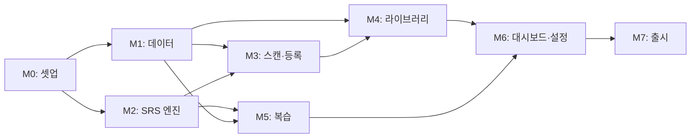

# 오답똑똑 — 제품 요구사항 문서 (PRD)

> 작성일: 2026-06-06
> 기반 문서: [IDEATION.md](IDEATION.md) · [ARCHITECTURE.md](ARCHITECTURE.md)
> 대상 독자: 개발자(본인) — 1인 개발 기준 계획
> 문서 버전: v1.0 (Phase 1 MVP 중심)

---

## 0. 문서 사용법

- **§1~§4**: 무엇을·왜 만드는가 (제품 정의)
- **§5~§7**: 무엇을·어떻게 만드는가 (요구사항)
- **§8~§11**: 누가·언제·어떤 순서로 (실행 계획)
- **§12~§14**: 어떻게 검증·운영하는가 (품질·리스크)

---

## 1. 제품 비전 & 한 줄 정의

> **"틀린 문제를 찍으면 정리해주고, 잊을 만하면 알려주는 나만의 오답 코치"**

- **비전**: 오답 정리의 수작업을 없애고, 망각곡선에 따라 강제 복습 루프를 만들어 학습 효율을 끌어올린다.
- **차별점**: 콴다/매쓰프레소가 "정답 검색"이라면, 오답똑똑은 **"내 오답의 자동 정리 + 복습 루프"**.

---

## 2. 목표 (Goals) / 비목표 (Non-goals)

### 2.1 v1 Goals
1. 한 손으로 10초 안에 오답 한 건을 기록할 수 있다.
2. 사용자가 따로 노력하지 않아도 망각곡선 시점에 복습 알림이 온다.
3. 과목별·태그별로 내 오답을 한눈에 모아볼 수 있다.
4. 모든 핵심 기능은 **오프라인에서 동작**한다.

### 2.2 v1 Non-goals
- 정답 자동 채점 / 풀이 자동 해설
- 낙서·풀이 흔적 자동 제거 (Phase 3 후보)
- 도표·그림 의미적 보정
- 학원·학교 B2B 기능
- 친구 공유·SNS 연동
- 클라우드 동기화 (Phase 2)
- LLM 자동 분류 (Phase 2)

---

## 3. 타겟 사용자

### 3.1 주 페르소나: 고등학생 "민지"
- 고2, 모의고사 풀이 후 오답노트 정리에 주 3시간 이상 소비
- 종이 오답노트는 만들지만 다시 보지 않음
- 학교/학원 이동 중 짬짬이 복습하고 싶지만 종이 노트가 무거움
- 안드로이드 갤럭시 사용, 데이터 통신 제한 있음

### 3.2 확장 페르소나 (v2 이후)
- 중학생, 공시·임고생, 대학생 전공 시험 준비자

---

## 4. 사용자 핵심 시나리오

### Scenario A — 첫 사용
1. 앱 설치 → 권한 동의 → 학년·과목 온보딩 3단계 → 메인 화면
2. 우상단 카메라 버튼 → 시험지 찍음 → 자동 원근 보정 → "수학"·"미적분" 태그 → 저장
3. 메인 화면에서 "오늘 복습 0/1" 카드 확인

### Scenario B — 하루 복습
1. 등굣길 8시 알림 "오늘 복습할 문제 3개"
2. 알림 탭 → 복습 화면 → 문제 이미지 보고 머릿속으로 풀기
3. "다시 / 어려움 / 좋음 / 쉬움" 4지선다 → 다음 문제
4. 3개 완료 → 메인 화면 "복습 달성률 100%" 애니메이션

### Scenario C — 라이브러리 탐색
1. 햄버거 메뉴 → 라이브러리 → "수학" 서랍 탭
2. "오답 횟수 순" 정렬 → 자주 틀리는 문제 Top 5 확인
3. 문제 카드 탭 → 상세 화면에서 OCR 텍스트·메모 확인

---

## 5. 기능 요구사항 (Functional Requirements)

### 5.1 기능 ID 체계
`F-{Phase}-{Epic}-{번호}` (예: `F-1-SCAN-03`)

### 5.2 Phase 1 기능 명세

#### EPIC: ONBOARDING (온보딩)

| ID | 기능 | 우선순위 | 인수 조건 |
|---|---|---|---|
| F-1-ONB-01 | 권한 요청 (카메라/저장소/알림) | P0 | iOS·Android 모두 시스템 다이얼로그로 요청, 거부 시 설정 이동 안내 |
| F-1-ONB-02 | 학년 선택 (중1~고3) | P0 | 6개 옵션 단일 선택, 건너뛰기 가능, 설정에서 변경 가능 |
| F-1-ONB-03 | 주 과목 선택 (다중) | P0 | 국·영·수·사·과 중 1개 이상 선택, 라이브러리 기본 노출 순서에 반영 |
| F-1-ONB-04 | 알림 시간대 설정 | P0 | 기본값 08:00 + 17:00, 사용자가 변경 가능, OS 알림 권한과 연동 |

#### EPIC: SCAN (스캔·등록)

| ID | 기능 | 우선순위 | 인수 조건 |
|---|---|---|---|
| F-1-SCAN-01 | 카메라 촬영 | P0 | 촬영 후 1초 이내 미리보기 표시, 가로/세로 모두 지원 |
| F-1-SCAN-02 | 갤러리에서 가져오기 | P0 | 시스템 picker로 1장 선택 가능 |
| F-1-SCAN-03 | 원근 보정 (자동) | P0 | OpenCV로 문서 모서리 검출 후 정사각 보정, 500ms 이내 완료, 실패 시 원본 사용 |
| F-1-SCAN-04 | 수동 크롭 | P0 | 4점 드래그로 크롭 영역 조정, 회전 90° 가능 |
| F-1-SCAN-05 | OCR 텍스트 추출 | P0 | ML Kit 한국어, 2초 이내, 결과는 편집 가능한 텍스트필드에 표시 |
| F-1-SCAN-06 | 과목 분류 | P0 | 국·영·수·사·과 5버튼, 1개만 선택 가능 |
| F-1-SCAN-07 | 태그·메모 입력 | P1 | 자유 태그 최대 5개, 메모 500자 이내 |
| F-1-SCAN-08 | 난이도 선택 | P1 | 상/중/하 3버튼, 선택 안 함 허용 |
| F-1-SCAN-09 | 저장 | P0 | 저장 후 상세 화면 자동 이동, 망각곡선 첫 알림 자동 예약 |

#### EPIC: LIBRARY (라이브러리)

| ID | 기능 | 우선순위 | 인수 조건 |
|---|---|---|---|
| F-1-LIB-01 | 과목별 서랍 뷰 | P0 | 5개 서랍(아이콘+개수), 탭 시 해당 과목 리스트 |
| F-1-LIB-02 | 리스트 정렬 | P0 | 최신순(기본) / 오답 횟수순 / 난이도순 3가지 |
| F-1-LIB-03 | 텍스트 검색 | P1 | OCR 텍스트·메모·태그 대상 부분 일치 |
| F-1-LIB-04 | 태그 필터 | P1 | 다중 선택, AND 조건 |
| F-1-LIB-05 | 카드 미리보기 | P0 | 썸네일 + OCR 첫 줄 + 오답 횟수 배지 |
| F-1-LIB-06 | 무한 스크롤 | P1 | 50개씩 로드, 끝 도달 시 추가 로드 |

#### EPIC: PROBLEM_DETAIL (문제 상세)

| ID | 기능 | 우선순위 | 인수 조건 |
|---|---|---|---|
| F-1-PD-01 | 이미지 확대 | P0 | 핀치 줌, 더블탭 확대 |
| F-1-PD-02 | OCR 텍스트 표시·편집 | P0 | 편집 버튼 → 인라인 편집, 자동 저장 |
| F-1-PD-03 | 메타데이터 수정 | P0 | 과목/단원/태그/난이도/메모 모두 변경 가능 |
| F-1-PD-04 | "지금 복습하기" 버튼 | P0 | 복습 모드로 진입, 결과 반영 |
| F-1-PD-05 | "다시 틀림" 카운트 +1 | P0 | 별도 버튼, 누를 때마다 wrongCount 증가 |
| F-1-PD-06 | 삭제 | P0 | 확인 다이얼로그 후 영구 삭제 (휴지통 없음 v1) |

#### EPIC: REVIEW (복습 루프)

| ID | 기능 | 우선순위 | 인수 조건 |
|---|---|---|---|
| F-1-REV-01 | 망각곡선 스케줄 생성 (SM-2) | P0 | 저장 시 `interval=1, ef=2.5` 초기화, 다음 알림 예약 |
| F-1-REV-02 | 로컬 알림 발송 | P0 | `nextReviewAt` 시각에 푸시. 메시지: "오늘 복습할 문제 N개" |
| F-1-REV-03 | 복습 화면 (스와이프 카드) | P0 | 한 문제씩 카드, 좌→다시 / 우→좋음 같은 단축 동작 + 4버튼 |
| F-1-REV-04 | 결과 반영 (SM-2 계산) | P0 | 결과에 따라 interval/ef 갱신, 다음 알림 재예약 |
| F-1-REV-05 | "오늘 다 했어요" 종료 | P0 | 큐 비면 완료 애니메이션 + 메인 복귀 |
| F-1-REV-06 | 미루기 | P1 | "내일 다시" 버튼, +1일 재예약 |

#### EPIC: DASHBOARD (메인 화면)

| ID | 기능 | 우선순위 | 인수 조건 |
|---|---|---|---|
| F-1-DASH-01 | 오늘 복습 카드 | P0 | 남은/전체 표시, 탭 시 복습 화면 진입 |
| F-1-DASH-02 | 복습 달성률 (오늘) | P0 | `완료/전체` 퍼센트 + 원형 차트 |
| F-1-DASH-03 | 연속 학습일 (Streak) | P1 | 마지막 복습 완료일 기준 연속 일수 |
| F-1-DASH-04 | 과목별 오답 수 요약 | P1 | 5개 막대 차트 (fl_chart) |
| F-1-DASH-05 | "+ 새 오답" FAB | P0 | 우하단 고정, 탭 시 카메라 진입 |

#### EPIC: SETTINGS (설정)

| ID | 기능 | 우선순위 | 인수 조건 |
|---|---|---|---|
| F-1-SET-01 | 알림 시간 변경 | P0 | 최대 3개 시간 등록 |
| F-1-SET-02 | 데이터 내보내기 (JSON) | P1 | 모든 문제·이미지 zip 다운로드 (공유 시트) |
| F-1-SET-03 | 전체 삭제 | P0 | 2단계 확인 후 영구 삭제 |
| F-1-SET-04 | 앱 정보·버전 | P0 | 버전·라이선스·문의 메일 |

### 5.3 Phase 2 기능 (요약)

| ID | 기능 |
|---|---|
| F-2-AUTH-01 | Firebase Auth (Apple/Google 로그인) |
| F-2-SYNC-01 | Firestore + Storage 양방향 동기화 |
| F-2-AI-01 | LLM 자동 분류 (과목/단원/태그/난이도 추천) |
| F-2-AI-02 | Mathpix 수식 OCR → LaTeX |
| F-2-STATS-01 | 약점 분석 화면 (단원별 오답률, 시간 트렌드) |
| F-2-DUP-01 | 동일 문제 자동 인식 (텍스트 정규화 + 임베딩) |

### 5.4 Phase 3 기능 (요약)

| ID | 기능 |
|---|---|
| F-3-CV-01 | 낙서/풀이 흔적 자동 제거 (SAM + LaMa) |
| F-3-CV-02 | 도표/그림 의미적 보정 |
| F-3-AI-03 | 난이도 자동 판정 (정답률 기반 + LLM) |

---

## 6. 비기능 요구사항 (Non-functional Requirements)

| 영역 | 요구사항 | 측정 방법 |
|---|---|---|
| 성능 | 콜드 스타트 < 2초 | Firebase Performance |
| 성능 | 스캔→저장 < 3초 (OpenCV 500ms + OCR 1.5초) | 통합 테스트 측정 |
| 성능 | 메인 대시보드 로딩 < 500ms | 위젯 테스트 |
| 가용성 | 오프라인 핵심 기능 100% 동작 (Phase 1) | 비행기 모드 테스트 |
| 신뢰성 | 충돌률 < 1% | Crashlytics |
| 보안 | 외부 API 키 클라이언트 노출 0건 | 코드 리뷰 + secret scan |
| 보안 | 통신 HTTPS/TLS 1.2+ | Firebase 기본 |
| 개인정보 | 이미지·OCR 텍스트 외부 로깅 금지 | 로깅 코드 리뷰 |
| 호환성 | iOS 14+, Android 8.0(API 26)+ | CI에서 buildable 확인 |
| 패키지 크기 | < 50MB | 빌드 산출물 측정 |
| 접근성 | 폰트 200% 확대 시 깨지지 않음 | 수동 점검 |

---

## 7. 화면 인벤토리

| ID | 화면 | 주요 기능 ID |
|---|---|---|
| S-01 | 온보딩 (3단계) | F-1-ONB-* |
| S-02 | 메인 대시보드 | F-1-DASH-* |
| S-03 | 카메라/스캔 | F-1-SCAN-01~04 |
| S-04 | 문제 등록 폼 | F-1-SCAN-05~09 |
| S-05 | 라이브러리 (서랍) | F-1-LIB-01 |
| S-06 | 과목 리스트 | F-1-LIB-02~06 |
| S-07 | 문제 상세 | F-1-PD-* |
| S-08 | 복습 모드 | F-1-REV-* |
| S-09 | 설정 | F-1-SET-* |

> 별도 와이어프레임 문서(WIREFRAMES.md)에서 화면별 레이아웃 상세화 예정.

---

## 8. 작업 분할 (Task Breakdown)

> 1인 개발 / 풀타임 가정. 시간 추정은 비교 단위로만 사용.

### EPIC 0. 프로젝트 셋업 (M0)

| Task ID | 작업 | 의존 | 산출물 | 인수 조건 |
|---|---|---|---|---|
| T-0.1 | Flutter 프로젝트 생성 (flavors: dev/stage/prod) | — | `flutter create` + `flutter_flavorizr` 설정 | `flutter run --flavor dev` 정상 |
| T-0.2 | 폴더 구조(`app/features/core`) 셋업 | T-0.1 | ARCHITECTURE.md §3.1 그대로 | 빈 폴더 + README |
| T-0.3 | 필수 패키지 추가 | T-0.1 | `pubspec.yaml` | `flutter pub get` 성공 |
| T-0.4 | Lint 룰 + `dart format` + `analysis_options.yaml` | T-0.1 | very_good_analysis | `flutter analyze` 0 issues |
| T-0.5 | GitHub repo + Actions CI (analyze + test) | T-0.4 | `.github/workflows/ci.yml` | PR에서 CI 통과 |
| T-0.6 | go_router 라우팅 골격 (9개 화면 빈 위젯) | T-0.2 | `app/router.dart` | 각 라우트 진입 확인 |
| T-0.7 | Riverpod ProviderScope + 테마 적용 | T-0.6 | `app/app.dart`, `app/theme.dart` | 라이트/다크 토글 가능 |

**M0 완료 조건**: 빈 9개 화면을 라우터로 이동 가능, CI 통과, 테마 적용.

---

### EPIC 1. 데이터 레이어 (M1)

| Task ID | 작업 | 의존 | 산출물 | 인수 조건 |
|---|---|---|---|---|
| T-1.1 | Drift DB 정의 (problems, tags 테이블) | T-0.3 | `core/data/datasources/local/app_database.dart` | 마이그레이션 v1 정의, 빌드 성공 |
| T-1.2 | Problem Entity + Enum (Subject/Difficulty 등) | — | `core/domain/entities/problem.dart` | freezed 또는 record 사용 |
| T-1.3 | ProblemMapper (Entity ↔ Drift row) | T-1.1, T-1.2 | `core/data/mappers/problem_mapper.dart` | 양방향 변환 단위 테스트 통과 |
| T-1.4 | ProblemRepository 인터페이스 | T-1.2 | `core/domain/repositories/problem_repository.dart` | 추상 메서드 8개 정의 |
| T-1.5 | LocalProblemRepository 구현 | T-1.3, T-1.4 | `core/data/repositories/local_problem_repository.dart` | save/findById/watch 단위 테스트 |
| T-1.6 | 이미지 파일 저장 유틸 | T-0.3 | `core/services/image/image_storage.dart` | 저장/삭제/경로 반환 테스트 |
| T-1.7 | Riverpod Provider 등록 | T-1.5 | `core/data/providers.dart` | 위젯에서 주입 가능 확인 |

**M1 완료 조건**: 단위 테스트로 Problem 1건 저장 → 조회 → 삭제 사이클 통과.

---

### EPIC 2. 망각곡선 엔진 (M2)

| Task ID | 작업 | 의존 | 산출물 | 인수 조건 |
|---|---|---|---|---|
| T-2.1 | SrsService 인터페이스 정의 | T-1.2 | `core/services/srs/srs_service.dart` | initialSchedule/nextSchedule 시그니처 |
| T-2.2 | SM-2 알고리즘 구현 | T-2.1 | `sm2_srs_service.dart` | 알고리즘 단위 테스트 100% 커버리지 |
| T-2.3 | 4가지 결과(again/hard/good/easy) 케이스 테스트 | T-2.2 | `sm2_srs_service_test.dart` | 각 케이스 예상 interval·ef 검증 |
| T-2.4 | NotificationService 추상 + 로컬 구현 | T-0.3 | `core/services/notification/*` | 알림 등록/취소/재등록 |
| T-2.5 | iOS 64개 한도 회피 (앱 실행 시 갱신) | T-2.4 | `core/services/notification/notification_refresher.dart` | "내일까지만 등록" 정책 |
| T-2.6 | Android 14+ 정확 알람 권한 처리 | T-2.4 | 권한 요청 흐름 | 권한 거부 시 안내 |

**M2 완료 조건**: SM-2 단위 테스트 통과 + 실기기에서 알림 수신 확인.

---

### EPIC 3. 스캔·등록 (M3)

| Task ID | 작업 | 의존 | 산출물 | 인수 조건 |
|---|---|---|---|---|
| T-3.1 | 카메라 화면 (camera 패키지) | T-0.6 | `features/scan/presentation/scan_screen.dart` | 촬영 후 미리보기 |
| T-3.2 | 갤러리 가져오기 | T-3.1 | `image_picker` 통합 | 사진 1장 선택 |
| T-3.3 | OpenCV 원근 보정 서비스 | T-0.3 | `core/services/image/perspective_corrector.dart` | 50장 샘플 평균 < 500ms |
| T-3.4 | 수동 크롭 UI | T-3.3 | `image_cropper` 또는 자체 4점 핸들 | 회전 90° 지원 |
| T-3.5 | ML Kit OCR 서비스 | T-0.3 | `core/services/ocr/ml_kit_ocr_service.dart` | 한국어 인식, confidence 반환 |
| T-3.6 | OCR 실패 fallback (직접 입력) | T-3.5 | confidence < 0.7 시 안내 배너 | 사용자 텍스트 입력 가능 |
| T-3.7 | 문제 등록 폼 (과목/태그/메모/난이도) | T-1.5 | `features/scan/presentation/register_form.dart` | 모든 필드 입력·저장 |
| T-3.8 | 저장 시 SrsService.initial 호출 + 알림 예약 | T-2.2, T-2.4, T-1.5 | ScanNotifier | 저장 후 nextReviewAt 정확 |

**M3 완료 조건**: 시나리오 A(첫 사용) 시연 가능, 통합 테스트 통과.

---

### EPIC 4. 라이브러리·상세 (M4)

| Task ID | 작업 | 의존 | 산출물 | 인수 조건 |
|---|---|---|---|---|
| T-4.1 | 과목 서랍 그리드 (5개 카드) | T-1.5 | `features/library/presentation/library_screen.dart` | 과목별 개수 실시간 |
| T-4.2 | 과목 리스트 + 정렬 드롭다운 | T-4.1 | `features/library/presentation/subject_list_screen.dart` | 3가지 정렬 동작 |
| T-4.3 | 텍스트 검색 (OCR/메모/태그) | T-4.2 | Drift LIKE 쿼리 | 부분 일치 결과 |
| T-4.4 | 태그 필터 (다중 선택) | T-4.3 | 칩 위젯 | AND 조건 |
| T-4.5 | 카드 위젯 (썸네일·뱃지) | T-4.2 | `features/library/widgets/problem_card.dart` | 디자인 일치 |
| T-4.6 | 문제 상세 화면 (이미지 확대/메타 수정) | T-1.5 | `features/problem_detail/...` | 모든 필드 수정 저장 |
| T-4.7 | "다시 틀림 +1" 버튼 | T-4.6 | wrongCount 증가 + UI 반영 | 카운트 즉시 갱신 |
| T-4.8 | 삭제 (확인 다이얼로그) | T-4.6 | 영구 삭제 + 알림 취소 | 리스트에서 사라짐 |

**M4 완료 조건**: 시나리오 C(라이브러리 탐색) 시연 가능.

---

### EPIC 5. 복습 모드 (M5)

| Task ID | 작업 | 의존 | 산출물 | 인수 조건 |
|---|---|---|---|---|
| T-5.1 | "오늘 복습" 큐 조회 | T-1.5 | `watchDueForReview` 구현 | 정렬: nextReviewAt 빠른 순 |
| T-5.2 | 복습 카드 UI (스와이프) | T-5.1 | `features/review/presentation/review_screen.dart` | 좌/우 스와이프 인식 |
| T-5.3 | 4지선다 결과 버튼 | T-5.2 | again/hard/good/easy | 햅틱 피드백 |
| T-5.4 | 결과 → SM-2 → 다음 알림 재예약 | T-2.2, T-2.4 | ReviewNotifier | 알림 재등록 검증 |
| T-5.5 | 큐 비면 완료 화면 | T-5.2 | 애니메이션 + 메인 복귀 | 스트릭 +1 |
| T-5.6 | 미루기 버튼 (+1일) | T-5.3 | 옵션 메뉴 | nextReviewAt = now + 1d |

**M5 완료 조건**: 시나리오 B(하루 복습) 시연 가능, 알림→완료 사이클 검증.

---

### EPIC 6. 대시보드·설정 (M6)

| Task ID | 작업 | 의존 | 산출물 | 인수 조건 |
|---|---|---|---|---|
| T-6.1 | 대시보드 데이터 Provider | T-5.1 | `features/dashboard/application/dashboard_provider.dart` | 오늘 큐·완료수 스트림 |
| T-6.2 | 오늘 복습 카드 + 원형 진행률 | T-6.1 | 메인 화면 상단 | 탭 시 복습 진입 |
| T-6.3 | 스트릭 카운터 | T-6.1 | 마지막 완료일 기반 | 자정 기준 재계산 |
| T-6.4 | 과목별 막대 차트 (fl_chart) | T-6.1 | 5개 막대 | 0건 과목도 표시 |
| T-6.5 | "+ 새 오답" FAB | T-3.1 | 우하단 FAB | 카메라 진입 |
| T-6.6 | 온보딩 3단계 | T-0.6 | `features/onboarding/...` | 1회만 노출, SharedPreferences 저장 |
| T-6.7 | 설정 화면 (알림/내보내기/전체삭제/정보) | T-1.5, T-2.4 | `features/settings/...` | 각 항목 정상 동작 |
| T-6.8 | JSON 내보내기 | T-6.7 | zip + share_plus | 다운로드 후 열림 |

**M6 완료 조건**: 전체 화면 9개 완성, Phase 1 기능 명세 100% 충족.

---

### EPIC 7. 출시 준비 (M7)

| Task ID | 작업 | 의존 | 산출물 | 인수 조건 |
|---|---|---|---|---|
| T-7.1 | Crashlytics 통합 | T-0.5 | firebase_crashlytics | 강제 크래시 → 콘솔 확인 |
| T-7.2 | 앱 아이콘·런치 스크린 | — | flutter_launcher_icons | iOS/Android 모두 |
| T-7.3 | 골든 테스트 (주요 5개 화면) | T-6.7 | `test/golden/` | CI에서 회귀 검출 |
| T-7.4 | 시험지 50장 OCR 회귀 셋 | T-3.5 | `test/fixtures/papers/` | 평균 정확도 측정 |
| T-7.5 | iOS TestFlight 배포 | T-7.1 | fastlane / Codemagic | 외부 테스터 5명 |
| T-7.6 | Android Play Internal 배포 | T-7.1 | fastlane / Codemagic | 외부 테스터 5명 |
| T-7.7 | 개인정보 처리방침 + 약관 페이지 | — | 정적 페이지 + 앱 내 링크 | 스토어 심사 통과 |
| T-7.8 | 스토어 등록 자료 (스크린샷·설명) | T-7.5 | iOS/Android 각 5장 | 한국어 우선 |

**M7 완료 조건**: 스토어 심사 제출 완료.

---

## 9. 마일스톤 & 의존성

**병렬 가능**: M1과 M2는 동시 진행 가능 (도메인 의존성 적음).

---

## 10. 우선순위 정책 (P0/P1/P2)

| 등급 | 의미 | 처리 정책 |
|---|---|---|
| P0 | 출시 필수 | 출시 전 100% 완료 |
| P1 | 출시 권장 | 시간 부족 시 출시 후 1주 내 핫픽스 |
| P2 | Nice-to-have | 다음 마이너 버전 |

> §5의 모든 P0 미완료 시 출시 보류.

---

## 11. 릴리스 계획

### v1.0.0 (Phase 1 MVP)
- §5.2의 P0 + P1 전체
- 안드로이드 우선 출시 → 1주 후 iOS

### v1.1.0 (+2주)
- P2 보류 항목, 사용자 피드백 핫픽스, 골든 테스트 확대

### v2.0.0 (Phase 2)
- §5.3 — 클라우드 동기화 + LLM 자동 분류 + Mathpix
- 약관 개정 (외부 전송 동의)

### v3.0.0 (Phase 3, 검증 후)
- §5.4 — 낙서 제거 등 고난도 CV

---

## 12. Definition of Done (DoD)

태스크가 "완료"라고 부르려면 모두 충족:

- [ ] 인수 조건 모두 통과
- [ ] 단위 테스트 작성 (도메인·서비스 한정, 위젯은 골든)
- [ ] `flutter analyze` 0 issues
- [ ] `dart format` 적용
- [ ] PR 셀프 리뷰 체크리스트 확인
- [ ] 실기기 1대 이상에서 수동 검증 (iOS or Android)
- [ ] 관련 문서(README/ARCHITECTURE 변경 사항) 업데이트

릴리스의 DoD:
- [ ] 모든 P0 태스크 완료
- [ ] 크래시 없이 시나리오 A·B·C 5회 반복 통과
- [ ] OCR 회귀 셋 평균 정확도 ≥ 80%
- [ ] 패키지 크기 < 50MB
- [ ] Crashlytics 24시간 베이크 후 0 crash
- [ ] 스토어 메타데이터 + 개인정보 처리방침 준비

---

## 13. 리스크 & 완충

| # | 리스크 | 영향 | 완충 (Mitigation) | 비상 계획 (Contingency) |
|---|---|---|---|---|
| R-1 | ML Kit 한국어 OCR 정확도 < 70% | 검색·복습 품질 저하 | 사용자 텍스트 편집 UI, confidence 표시 | Phase 2 Mathpix/CLOVA 조기 도입 |
| R-2 | iOS 백그라운드 알림 64개 한도 | 장기 복습 누락 | 앱 실행 시 알림 재등록 로직 | FCM 원격 푸시 보완 |
| R-3 | OpenCV 원근 보정 실패율 높음 | 사용자 불편 | 실패 시 원본 사용 + 수동 크롭 | 수동 4점 입력 UX 강화 |
| R-4 | 시험지 저작권 이슈 | 출판사 클레임 | 약관에 "사적 이용 한정" 명시, 외부 전송 없음 | 신고 접수 채널 운영 |
| R-5 | 1인 개발 일정 지연 | 출시 지연 | P1·P2 축소, P0만 출시 | v1.1로 P1 이월 |
| R-6 | 안드로이드 단편화로 빌드 깨짐 | 일부 사용자 미동작 | minSdk 26 고정, BrowserStack 등으로 5종 검증 | 베타 채널 우선 배포 |
| R-7 | Drift 마이그레이션 실수로 사용자 데이터 손상 | 신뢰 상실 | 마이그레이션 단위 테스트 + 백업 다이얼로그 | 자동 롤백 + JSON 내보내기 안내 |

---

## 14. 의사결정 & 변경 이력

| 일자 | 결정/변경 | 결정자 | 비고 |
|---|---|---|---|
| 2026-06-06 | Phase 1 MVP에서 낙서 제거·자동 분류·Mathpix 제외 | 본인 | 3-Way AI 교차검증 만장일치 (IDEATION §4.1) |
| 2026-06-06 | 백엔드는 Phase 2부터 (Firebase) | 본인 | 오프라인 우선 원칙 |
| 2026-06-06 | Flutter + Riverpod + Drift 채택 | 본인 | ARCHITECTURE §15 ADR |
| 2026-06-06 | 안드로이드 우선 출시 (페르소나 "민지") | 본인 | iOS 1주 후 |
| 2026-06-13 | 로컬 DB: **Drift** 최종 결정 | 본인 | SQL 쿼리·복잡 필터링·마이그레이션 안정성 (Hive 대체) |
| 2026-06-13 | Phase 2 백엔드: **Firebase** 최종 확정 | 본인 | Firestore NoSQL + Functions + FCM 통합 최고. Supabase 대안 제시 |
| 2026-06-13 | Phase 2 수식 OCR: **Mathpix API** 초기 채택 | 본인 | 정확도 90%+ (pix2tex 60~70% 대비). 비용 월 $5 예상. Phase 2.1에서 pix2tex 전환 검토 |
| 2026-06-13 | Phase 3 인페인팅: **SAM + LaMa** 권장 (미실행) | 본인 | 오픈소스, 자체 호스팅 가능. ClipDrop은 유료로 인식하지 않음 (검증 후) |
| 2026-06-13 | 다음 우선: **WIREFRAMES.md 작성** | 본인 | 9개 화면 레이아웃·상호작용 정의 필수 (코딩 전) |

---

## 15. 부록

### 15.1 용어 정의
- **SRS (Spaced Repetition System)**: 망각곡선 기반 간격 반복 학습
- **SM-2**: SuperMemo-2 알고리즘. Anki가 채택한 SRS 표준
- **OCR**: Optical Character Recognition. 광학 문자 인식
- **인페인팅(Inpainting)**: 이미지의 특정 영역을 주변 정보로 자연스럽게 채우는 기법
- **온디바이스 처리**: 클라우드 전송 없이 폰에서 직접 수행

### 15.2 참조 문서
- 기획 검토 + AI 교차검증: [IDEATION.md](IDEATION.md)
- 시스템 아키텍처: [ARCHITECTURE.md](ARCHITECTURE.md)
- 화면 와이어프레임: WIREFRAMES.md (예정)
- API 명세: API.md (Phase 2부터)

### 15.3 PR 셀프 리뷰 체크리스트 (참고)
- [ ] 인수 조건 모두 충족
- [ ] 새 의존성 추가 시 ARCHITECTURE 업데이트
- [ ] 사용자 데이터 외부 전송 없음
- [ ] 에러 케이스 처리 (네트워크 실패·권한 거부·디스크 가득)
- [ ] 한국어 문구 일관성 (반말/존댓말 통일)
- [ ] 다크 모드 대응
