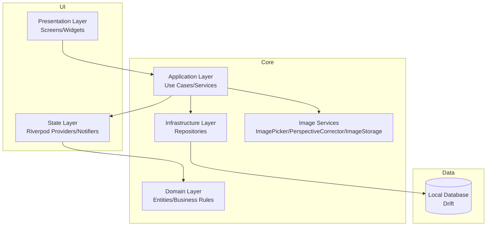

# 오답똑똑 애플리케이션 문서

## 애플리케이션 개요
오답똑똑은 학습자가 틀린 문제를 저장하고, 복습 주기에 맞춰 다시 학습할 수 있도록 돕는 Flutter 기반 애플리케이션입니다.

핵심 기능은 다음과 같습니다.
- 온보딩: 과목 선택 및 초기 학습 설정
- 스캔: 갤러리 이미지 선택, 원근 보정, 수동 크롭
- 복습: SM-2 기반 스케줄링으로 복습 대상 관리
- 데이터 관리: 로컬 DB(Drift) 기반 문제 저장/조회/수정/삭제

## 전체 아키텍처 다이어그램


## 시작하기

### 사전 개발 환경 요구사항 (Prerequisites)
- Flutter SDK (프로젝트에서 사용하는 버전)
- Dart SDK (Flutter 포함)
- Git
- Android Studio 또는 Xcode (플랫폼별 빌드 시)
- (선택) Puro

Windows PowerShell 환경에서 스크립트 실행 정책 이슈가 있을 경우:
```powershell
Set-ExecutionPolicy -Scope Process -ExecutionPolicy Bypass -Force
```

### 애플리케이션 실행하기 (로컬)
1. 저장소 루트로 이동합니다.
2. 의존성을 설치합니다.
3. 앱을 실행합니다.

Puro 사용 시:
```powershell
puro flutter pub get
puro flutter run
```

일반 Flutter 사용 시:
```powershell
flutter pub get
flutter run
```

### 애플리케이션 배포하기 (Azure)
추후 작성

### 애플리케이션 테스트하기
단위/위젯/통합 테스트를 실행합니다.

Puro 사용 시:
```powershell
puro flutter test
```

일반 Flutter 사용 시:
```powershell
flutter test
```

정적 분석:
```powershell
puro flutter analyze
```
또는
```powershell
flutter analyze
```
